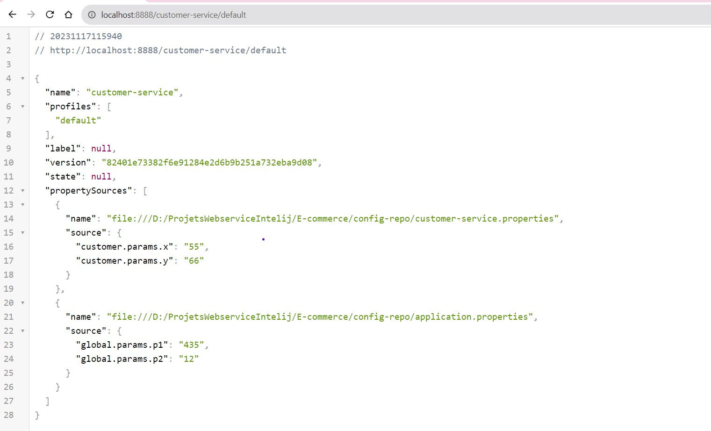
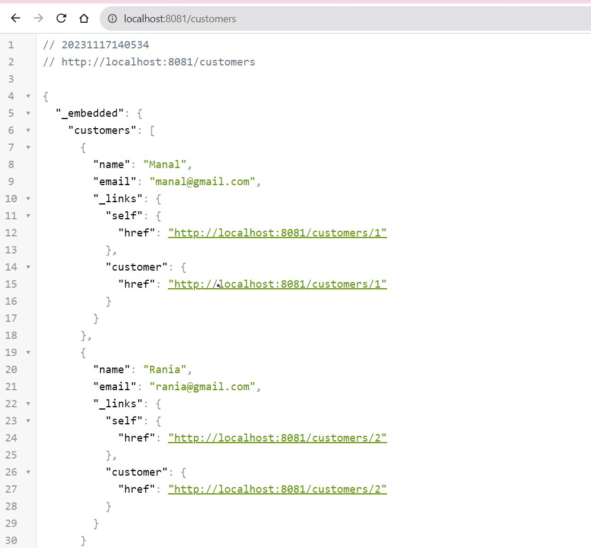

<h1>GASMI MANAL</h1>
<h2>Activité Pratique N°4 : Mise en oueuvre d'une architecture Micro-services avec Spring Cloud, Consul, Vault , Angular</h2>
<h3>Interface Consul</h3>

<h3>Configuration par défaut de l'application</h3>

<h3>Lancement de config-service apparition sur interface Consul</h3>

<h3>La configuration par défaut de customer-service</h3>

<h3>La configuration par défaut de customer-service-dev</h3>

<h3>La configuration de inventory-service-dev</h3>

<h3>La configuration de inventory-service par défaut</h3>

<h3>Service reconnait les parametres et recupere les valeurs</h3>

<h3>Utilisation de l'annotation refreshscope et changement des valeurs x et y</h3>

<h3>Execution de la methode POST </h3>

<h3>Modification a chaud grace a la méthode POST</h3>

<h3>H2 console </h3>

<h3>List des clients</h3>

<h3>Récupérer un client en fournissant son ID</h3>

<h3>Accés aux clients à partie de la gateway</h3>

<h3>Récupération des paramétres à partir de la gateway customer-service</h3>

<h3>Apparition de inventory_service sur consul</h3>

<h3>Affichage d'un produit récupérer par son id</h3>

<h3>Affichage de l'id du produit gràce a une projection qui porte le nom fullProduct</h3>

<h3>Une projection pour customer-service</h3>

<h3>Apparition de order-service sur consul</h3>

<h3>Affichage des commandes</h3>

<h3>Affichage des produits de la commande</h3>

<h3>H2-console commandes</h3>

<h3>H2-console des produits</h3>

<h3>Affichage avant utilisation de jsonproperty</h3>

<h3>Apres utilisation de jsonproperty</h3>

<h3>Utilisation de logger</h3>

<h3>Vault</h3>

<h3>Vault dashboard</h3>

<h3>Création des keyvalue</h3>

<h3>Récuperation des valeurs</h3>

<h3>Création des cles avec valeurs</h3>

<h3>Affichage sur vault de ces key value crée</h3>

<h3>Ajout d'une autre clé</h3>

<h3>Visualisation de ces clés sur la console</h3>

<h3>Consultation de myConfig</h3>

<h3>Modification de la valeur de la clé otp lancement d'un erequete avec la méthode POST</h3>

<h3>Ajout de keypair a partir de fileconfig qui est dans un microservice</h3>

<h2>Partie FRONT-END avce Angular</h2>
<h3>Récupération des produits à partir de BACK-END</h3>

<h3>Liste des clients à partir du BACK-END</h3>

<h3>Ajout de bouton Order qui contient les commandes passés par ce client</h3>

<h3>Le détail de la commande</h3>

<h3>En cliquant sur le bouton Order details</h3>
